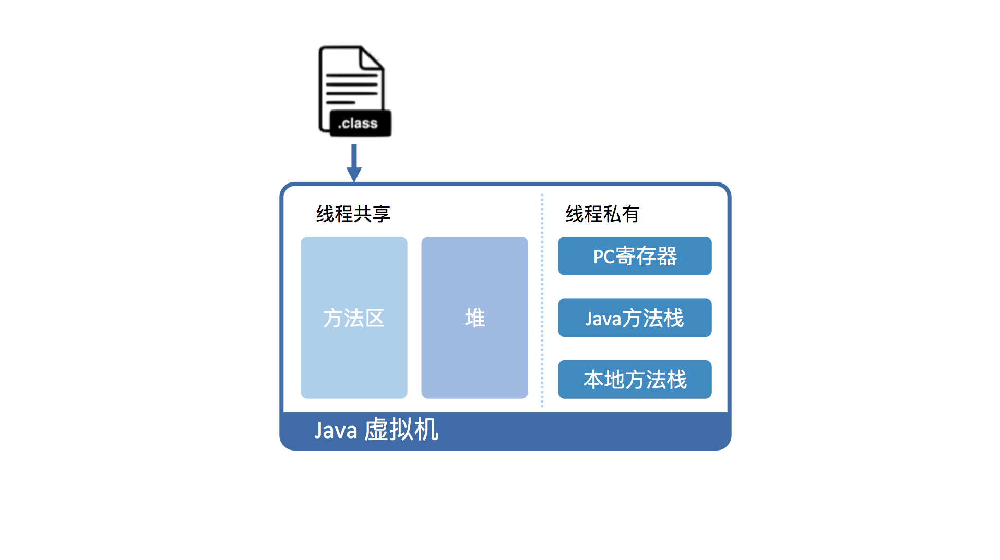
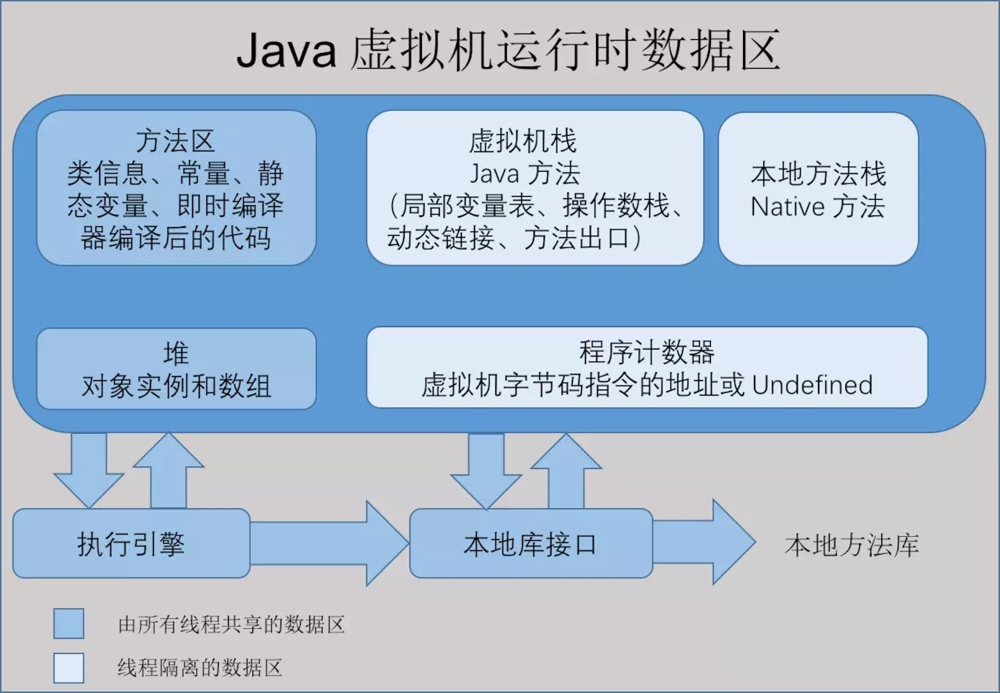
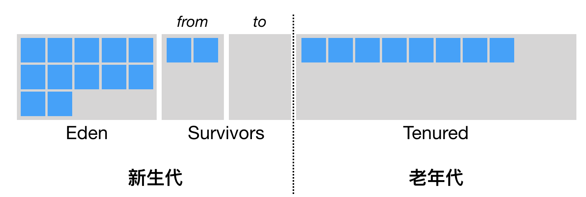

# 类加载

分为三步：加载-链接-初始化

- 加载：  
1. 加载，是指查找字节流，并且据此创建类的过程。
2. 双亲委派模型：启动类加载器（jre的lib下的包，以及由虚拟机参数 -Xbootclasspath 指定的类）->扩展（平台）类加载器（JRE 的 lib/ext 目录下 jar 包中的类（以及由系统变量 java.ext.dirs 指定的类））->应用类加载器（负责加载应用程序路径下的类。这里的应用程序路径，便是指虚拟机参数 -cp/-classpath、系统变量 java.class.path 或环境变量 CLASSPATH 所指定的路径。）

- 链接：  
1. 是指将创建成的类合并至 Java 虚拟机中，使之能够执行的过程。它可分为验证、准备以及解析三个阶段。
1. 验证：验证阶段的目的，在于确保被加载类能够满足 Java 虚拟机的约束条件。
1. 准备：准备阶段的目的，则是为被加载类的静态字段分配内存。Java 代码中对静态字段的具体初始化，则会在稍后的初始化阶段中进行。
1. 解析：解析阶段的目的，正是将这些符号引用解析成为实际引用。如果符号引用指向一个未被加载的类，或者未被加载类的字段或方法，那么解析将触发这个类的加载。

- 初始化：  
1. 为标记为常量值的字段赋值，以及执行 < clinit > 方法的过程。类的初始化仅会被执行一次，这个特性被用来实现单例的延迟初始化。

2. 类的初始化何时会被触发呢？JVM 规范枚举了下述多种触发情况：
当虚拟机启动时，初始化用户指定的主类；
当遇到用以新建目标类实例的 new 指令时，初始化 new 指令的目标类；
当遇到调用静态方法的指令时，初始化该静态方法所在的类；
当遇到访问静态字段的指令时，初始化该静态字段所在的类；
子类的初始化会触发父类的初始化；
如果一个接口定义了 default 方法，那么直接实现或者间接实现该接口的类的初始化，会触发该接口的初始化；
使用反射 API 对某个类进行反射调用时，初始化这个类；
当初次调用 MethodHandle 实例时，初始化该 MethodHandle 指向的方法所在的类。

# JAVA对象的内存布局
- 除了new 语句之外，我们还可以通过反射机制、Object.clone 方法、反序列化以及 Unsafe.allocateInstance 方法来新建对象。
- 常见的 new 语句会被编译为 new 指令，以及对构造器的调用。每个类的构造器皆会直接或者间接调用父类的构造器，并且在同一个实例中初始化相应的字段。
- Java 虚拟机引入了压缩指针的概念，将原本的 64 位指针压缩成 32 位。压缩指针要求 Java 虚拟机堆中对象的起始地址要对齐至 8 的倍数。Java 虚拟机还会对每个类的字段进行重排列，使得字段也能够内存对齐。

***

# 垃圾回收

- 垃圾识别方式：
1. 引用计数法：
为每个对象添加一个引用计数器，用来统计指向该对象的引用个数。一旦某个对象的引用计数器为 0，则说明该对象已经死亡，便可以被回收了。需要额外的空间来存储计数器，以及繁琐的更新操作，引用计数法还有一个重大的漏洞，那便是无法处理循环引用对象。
2. 可达性分析：  
主流，这个算法的实质在于将一系列 GC Roots 作为初始的存活对象合集（live set），然后从该合集出发，探索所有能够被该集合引用到的对象，并将其加入到该集合中，这个过程我们也称之为标记（mark）。最终，未被探索到的对象便是死亡的，是可以回收的。
GC Roots ：我们可以暂时理解为由堆外指向堆内的引用，一般而言，GC Roots 包括（但不限于）如下几种：  
1.Java 方法栈桢中的局部变量；  
2.已加载类的静态变量；  
3.JNI handles；  
4.已启动且未停止的 Java 线程。  
3. stop the world：为了防止在标记过程中堆栈的状态发生改变，Java 虚拟机采取安全点机制来实现 Stop-the-world 操作，暂停其他非垃圾回收线程。

- 垃圾回收方式：  
1. 清除（sweep）：  
即把死亡对象所占据的内存标记为空闲内存，并记录在一个空闲列表（free list）之中。当需要新建对象时，内存管理模块便会从该空闲列表中寻找空闲内存，并划分给新建的对象。
缺点：一是会造成内存碎片。由于 Java 虚拟机的堆中对象必须是连续分布的，因此可能出现总空闲内存足够，但是无法分配的极端情况。另一个则是分配效率较低。如果是一块连续的内存空间，那么我们可以通过指针加法（pointer bumping）来做分配。而对于空闲列表，Java 虚拟机则需要逐个访问列表中的项，来查找能够放入新建对象的空闲内存。
2. 压缩（compact）：  
把存活的对象聚集到内存区域的起始位置，从而留下一段连续的内存空间。这种做法能够解决内存碎片化的问题，但代价是压缩算法的性能开销。
3. 复制（copy）：  
把内存区域分为两等分，分别用两个指针 from 和 to 来维护，并且只是用 from 指针指向的内存区域来分配内存。当发生垃圾回收时，便把存活的对象复制到 to 指针指向的内存区域中，并且交换 from 指针和 to 指针的内容。复制这种回收方式同样能够解决内存碎片化的问题，但是它的缺点也极其明显，即堆空间的使用效率极其低下。

- 垃圾回收算法：
1. 标记清除算法：
2. 复制算法：
3. 标记整理算法：
4. 分代收集算法：

- 垃圾回收器：  
  

|  | Serial| Parallel| Scavenge | Parallel New | Serial Old | Parallel Old | CMS | G1 |
|:---|:---|:---|:---|:---|:---|:---|:---|:----|    
|应用内存区| 新生代| 新生代| 新生代| 老年代| 老年代| 老年代|   
|使用算法| 标记-复制算法| 标记-复制算法| 标记-复制算法| 标记-压缩算法| 标记-压缩算法| 标记-清除算法| 
|描述| 单线程stop| the world 与后者类似，更加注重吞吐量，但不能与CMS一起使用,并行，多线程| 多线程| 单线程stop the world 多线程 |并发收集，少数几个stop-the-world,收集失败由前两个出马，在java 9中被废弃| 针对每个细分区域收集，优先回收死亡对象较多的区域并行，并发|

  注：并行（GC线程和应用线程同时工作），并发（多个GC线程同时工作）

- 堆的划分：  
  

- Java 虚拟机将堆划分为新生代和老年代。其中，新生代又被划分为 Eden 区，以及两个大小相同的 Survivor 区。

1. 新生代（Minor GC 标记 - 复制）:
- 1.1 默认情况下，Java 虚拟机采取的是一种动态分配的策略（对应 Java 虚拟机参数 -XX:+UsePSAdaptiveSurvivorSizePolicy），根据生成对象的速率，以及 Survivor 区的使用情况动态调整 Eden 区和 Survivor 区的比例。当然，你也可以通过参数 -XX:SurvivorRatio 来固定这个比例。但是需要注意的是，其中一个 Survivor 区会一直为空，因此比例越低浪费的堆空间将越高。
- 1.2 当我们调用 new 指令时，它会在 Eden 区中划出一块作为存储对象的内存。由于堆空间是线程共享的，因此直接在这里边划空间是需要进行同步的。具体来说，每个线程可以向 Java 虚拟机申请一段连续的内存，比如 2048 字节，作为线程私有的 TLAB,这项技术被称之为 TLAB（Thread Local Allocation Buffer，对应虚拟机参数 -XX:+UseTLAB，默认开启）。
- 1.3 当发生 Minor GC 时，Eden 区和 from 指向的 Survivor 区中的存活对象会被复制到 to 指向的 Survivor 区中，然后交换 from 和 to 指针，以保证下一次 Minor GC 时，to 指向的 Survivor 区还是空的。
- 1.4 Java 虚拟机会记录 Survivor 区中的对象一共被来回复制了几次。如果一个对象被复制的次数为 15（对应虚拟机参数 -XX:+MaxTenuringThreshold），那么该对象将被晋升（promote）至老年代。另外，如果单个 Survivor 区已经被占用了 50%（对应虚拟机参数 -XX:TargetSurvivorRatio），那么较高复制次数的对象也会被晋升至老年代。
- 1.5 minor GC的问题：老年代的对象可能引用新生代的对象。也就是说，在标记存活对象的时候，我们需要扫描老年代中的对象。如果该对象拥有对新生代对象的引用，那么这个引用也会被作为 GC Roots。解决方案：HotSpot中的卡表，该技术将整个堆划分为一个个大小为 512 字节的卡，并且维护一个卡表，用来存储每张卡的一个标识位。这个标识位代表对应的卡是否可能存有指向新生代对象的引用。如果可能存在，那么我们就认为这张卡是脏的。
在进行 Minor GC 的时候，我们便可以不用扫描整个老年代，而是在卡表中寻找脏卡，并将脏卡中的对象加入到 Minor GC 的 GC Roots 里。当完成所有脏卡的扫描之后，Java 虚拟机便会将所有脏卡的标识位清零。

***

# java内存模型：
1. happens-before:  
happens-before 关系是用来描述两个操作的内存可见性的。如果操作 X happens-before 操作 Y，那么 X 的结果对于 Y 可见。
happens-before的规则：
- 1.1 程序次序规则：在一个线程内一段代码的执行结果是有序的。就是还会指令重排，但是随便它怎么排，结果是按照我们代码的顺序生成的不会变。
- 1.2 管程锁定规则：就是无论是在单线程环境还是多线程环境，对于同一个锁来说，一个线程对这个锁解锁之后，另一个线程获取了这个锁都能看到前一个线程的操作结果！(管程是一种通用的同步原语，synchronized就是管程的实现）
- 1.3 volatile变量规则：就是如果一个线程先去写一个volatile变量，然后一个线程去读这个变量，那么这个写操作的结果一定对读的这个线程可见。线程启动规则：在主线程A执行过程中，启动子线程B，那么线程A在启动子线程B之前对共享变量的修改结果对线程B可见。
- 1.4 线程终止规则：在主线程A执行过程中，子线程B终止，那么线程B在终止之前对共享变量的修改结果在线程A中可见。也称线程join()规则。
- 1.5 线程中断规则：对线程interrupt()方法的调用先行发生于被中断线程代码检测到中断事件的发生，可以通过Thread.interrupted()检测到是否发生中断。
- 1.6 传递性规则：这个简单的，就是happens-before原则具有传递性，即hb(A, B) ， hb(B, C)，那么hb(A, C)。
对象终结规则：这个也简单的，就是一个对象的初始化的完成，也就是构造函数执行的结束一定 happens-before它的finalize()方法。

- Java 内存模型是通过内存屏障来禁止重排序的。对于即时编译器来说，内存屏障将限制它所能做的重排序优化。对于处理器来说，内存屏障会导致缓存的刷新操作。

2. 引用类型：  
- 2.1 强引用：  
类似于 Object obj = new Object(); 创建的，只要强引用在就不回收。
- 2.2 软引用：  
SoftReference 类实现软引用。在系统要发生内存溢出异常之前，将会把这些对象列进回收范围之中进行二次回收。
- 2.3 弱引用：  
WeakReference 类实现弱引用。对象只能生存到下一次垃圾收集之前。在垃圾收集器工作时，无论内存是否足够都会回收掉只被弱引用关联的对象。
- 2.4 虚引用：  
PhantomReference 类实现虚引用。无法通过虚引用获取一个对象的实例，为一个对象设置虚引用关联的唯一目的就是能在这个对象被收集器回收时收到一个系统通知。

3. volatile:
- 3.1 保证此变量对所有线程的可见性。但是操作并非原子操作，并发情况下不安全。
2、禁止指令重排序优化,通过插入内存屏障保证一致性。

4. JVM参数设置：  
java -Xmx3550m -Xms3550m -Xss128k -XX:NewRatio=4 -XX:SurvivorRatio=4 -XX:MaxPermSize=16m -XX:MaxTenuringThreshold=0  

- 4.1 -Xmx3550m：设置JVM最大可用内存为3550M。  
- 4.2 -Xms3550m：设置JVM促使内存为3550m。此值可以设置与-Xmx相同，以避免每次垃圾回收完成后JVM重新分配内存。  
- 4.3 -Xmn2g：设置年轻代大小为2G。整个堆大小=年轻代大小 + 年老代大小 + 持久代大小。持久代一般固定大小为64m，所以增大年轻代后，将会减小年老代大小。此值对系统性能影响较大，Sun官方推荐配置为整个堆的3/8。  		
- 4.4 -Xss128k：设置每个线程的堆栈大小。JDK5.0以后每个线程堆栈大小为1M，以前每个线程堆栈大小为256K。更具应用的线程所需内存大小进行调整。在相同物理内存下，减小这个值能生成更多的线程。但是操作系统对一个进程内的线程数还是有限制的，不能无限生成，经验值3000~5000左右。  
- 4.5 -XX:NewRatio=4:设置年轻代（包括Eden和两个Survivor区）与年老代的比值（除去持久代）。设置为4，则年轻代与年老代所占比值为1：4，年轻代占整个堆栈的1/5  
- 4.6 -XX:SurvivorRatio=4：设置年轻代中Eden区与Survivor区的大小比值。设置为4，则两个Survivor区与一个Eden区的比值为2:4，一个Survivor区占整个年轻代的1/6  
- 4.7 -XX:MaxPermSize=16m:设置持久代大小为16m。
- 4.8 -XX:MaxTenuringThreshold=0：设置垃圾最大年龄。如果设置为0的话，则年轻代对象不经过Survivor区，直接进入年老代。对于年老代比较多的应用，可以提高效率。如果将此值设置为一个较大值，则年轻代对象会在Survivor区进行多次复制，这样可以增加对象再年轻代的存活时间，增加在年轻代即被回收的概论。

# 常见配置汇总：
1. 堆设置  
- 1.1 -Xms:初始堆大小
- 1.2 -Xmx:最大堆大小
- 1.3 -XX:NewSize=n:设置年轻代大小
- 1.4 -XX:NewRatio=n:设置年轻代和年老代的比值。如:为3，表示年轻代与年老代比值为1：3，年轻代占整个年轻代年老代和的1/4
- 1.5 -XX:SurvivorRatio=n:年轻代中Eden区与两个Survivor区的比值。注意Survivor区有两个。如：3，表示Eden：Survivor=3：2，一个Survivor区占整个年轻代的1/5
- 1.6 -XX:MaxPermSize=n:设置持久代大小

2. 收集器设置
- 2.1 -XX:+UseSerialGC:设置串行收集器
- 2.2 -XX:+UseParallelGC:设置并行收集器
- 2.3 -XX:+UseParalledlOldGC:设置并行年老代收集器
- 2.4 -XX:+UseConcMarkSweepGC:设置并发收集器

3. 垃圾回收统计信息
- 3.1 -XX:+PrintGC
- 3.2 -XX:+PrintGCDetails
- 3.3 -XX:+PrintGCTimeStamps
- 3.4 -Xloggc:filename

4. 并行收集器设置
- 4.1 -XX:ParallelGCThreads=n:设置并行收集器收集时使用的CPU数。并行收集线程数。
- 4.2 -XX:MaxGCPauseMillis=n:设置并行收集最大暂停时间
- 4.3 -XX:GCTimeRatio=n:设置垃圾回收时间占程序运行时间的百分比。公式为1/(1+n)

5. 并发收集器设置
- 5.1 -XX:+CMSIncrementalMode:设置为增量模式。适用于单CPU情况。
- 5.2 -XX:ParallelGCThreads=n:设置并发收集器年轻代收集方式为并行收集时，使用的CPU数。并行收集线程数。

# 参考：
> - https://blog.csdn.net/qq_41701956/article/details/81664921  
> - 极客时间：深入拆解JAVA虚拟机

